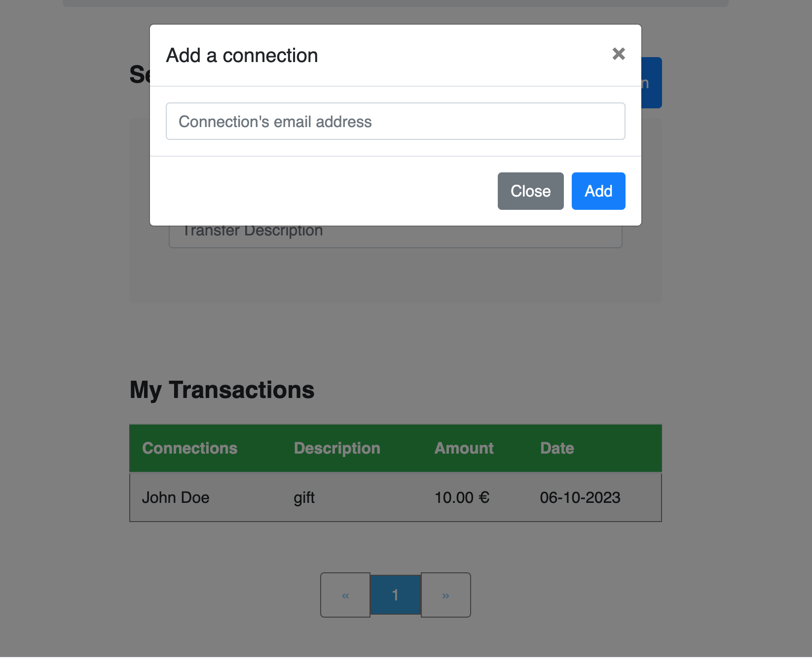

# Pay My Buddy
## Instructions on how to start the app

### Requirements

For building and running the application you need:

- [JDK 1.8](http://www.oracle.com/technetwork/java/javase/downloads/jdk8-downloads-2133151.html)
- [Maven 3](https://maven.apache.org)

### Clone Repository
```
git clone https://github.com/MarieRodiet/payMyBuddy.git
```

### Start the App
```
$ mvn spring-boot:run
```

## Documentation
### Modèle physique de données


### Diagramme de classe UML


### Jacoco report


### Login


### Register


### Transfers


### Add connection


### Profile


### Edit profile

